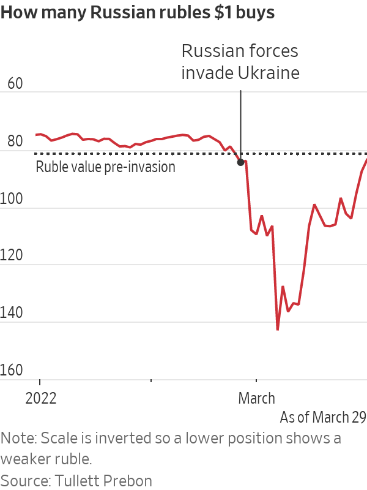

# Ateliers Trading : COURS 1 : Introduction, la plateforme et les marchés

## 1) **Création d'un compte TradingView**

> :warning: **N'utilisez pas votre adresse mail Telecom pour créer votre compte**

Aller sur le site officiel de TradingView : <a href="https://fr.tradingview.com/">TradingView</a>.

- Vous devriez tomber sur une page de ce style, cliquez sur `Commencez` : 

- Cliquez à nouveau sur `Commencez` et inscrivez-vous :

> :warning: **N'utilisez pas votre adresse mail Telecom pour créer votre compte, on en aura besoin plus tard... :)**
 

- Une fois que vous avez validé votre compte via le lien envoyé sur votre boite e-mail, finissez votre inscription (pseudo, prénom, nom) et c'est bon !

- Vous êtes normalement bien connecté, on peut commencer à se balader sur le site.

- Présentation de la plateforme...

 
 
 

## 2) **Présentation des marchés**

Il existe plusieurs types de marchés sur lesquels un retail trader (un trader normal comme nous par exemple) peut exercer du trading :

- **Marchés actions** : Les marchés actions, également appelés marchés d'actions, sont où les actions des sociétés cotées en bourse sont achetées et vendues. Les marchés actions les plus connus sont la NYSE (bourse de New York), Nasdaq (place boursière).  
:warning: La différence entre les deux est que dans la NYSE, il y a un seul "market maker" alors que dans le NASDAQ il y en a plusieurs.  
Un **market maker** est une organisation qui met en relation acheteurs et vendeurs :

Le **Bid** représente le prix auquel un acheteur cherche à acquérir des contrats (par exemple, 1 action de Tesla)  
Le **Ask** représente le prix auquel un vendeur cherche à vendre ses contrats

 
 

- **Marchés forex** : Les marchés Forex, également appelés marchés des devises étrangères ou des changes, sont où les différentes devises sont achetées et vendues. Les marchés Forex permettent d'échanger des devises.  
Imaginons que vous êtes Apple et que vous voulez payer vos employés chinois en devise chinoise, mais que vous n'avez que des dollars en cash : vous allez passer par le marché Forex pour "transformer" vos dollars en Yuan.  
Ces marchés sont très liés à l'économie des pays comme le montre le graphe suivant :

 
 

- **Marchés des matières premières** : Les marchés des matières premières sont où les matières premières et les produits agricoles sont achetés et vendus. Ces marchés incluent les marchés énergétiques (pétrole, gaz naturel, etc.), les marchés métalliques (or, argent, etc.) et les marchés agricoles (blé, maïs, etc.).  
:warning: Lorsqu'un trader achète un contrat sur ce marché, c'est comme s'il achetait la matière première en question (donc il doit trouver un moyen de la transporter, de la stocker, etc...)

 
 

- **Marchés des crypto-monnaies** : Les marchés des crypto-monnaies sont des places de marché numériques où différents types de crypto-monnaies peuvent être achetées et vendues. Comme pour les matières premières, si on achète de la crypto sur ces marchés, on reçoit réellement cette crypto sur notre wallet.

 
 

- **Marchés obligataires** : Les marchés obligataires, également appelés marchés à revenu fixe, sont où les obligations d'État et d'entreprise sont achetées et vendues.  
Pour résumer, les états ou entreprises "émettent" des obligations, ce qui revient à dire qu'ils vont emprunter de l'argent. Ces marchés permettent donc à des particuliers d'acheter de la dette d'un état, et donc de recevoir des intêrets tous les mois, comme une assurance.

 
 

- **Marchés dérivés** : Les marchés dérivés sont où des instruments financiers, tels que les options et les futures, sont achetés et vendus.  
Les futures sont les marchés qui nous intéressent le plus en tant que trader car on peut gagner de l'argent même si le marché descend.  
Pour comprendre pourquoi on va présenter la notion de long et short :
 

Ils sont toujours liés à un **soujacent**. Le soujacent est le marché d'actions, ou de FOREX, ou de crypto qui lui est associé et dont le prix est le même.

**EN GROS LES MARCHES FUTURES PERMETTENT DE PARIER SUR LE COURS DU MARCHE SOUJACENT**

 
 
 
 

## 3) **Lire un graphique**

- Bougies (chandeliers japonais) : corps, mèches

- Temporalité (time frame)

- Volume : le volume représente le nombre de contrats achetés (et donc vendus) pendant la temporalité d'une bougie.  
Ce sont les barres verticales qu'on voit en bas du chart.

:warning: Spécificité de TradingView qui est très utile : les icônes au niveau du volume. Ces icônes indiquent qu'il s'est passé quelque chose d'important en lien avec le marché observé.  
Par exemple **'E'** signigie qu'il y a eu un *Earnings Report*, c'est à dire que Tesla a publié ses ventes. Ce sont des infos importantes car elles sont souvent à la base de gros mouvement de prix.

 
 
 
 

## 4) **Choisir un brokeur**

- Cliquer sur Espace de Trading en dessous du graphique :

- Choisir Paper Trading, c'est le compte démo de TradingView, pour trader avec un portefeuille virtuel.

 
 

## **5) Premier trade**

 
 
 

## **Bonus : Analyse technique**
