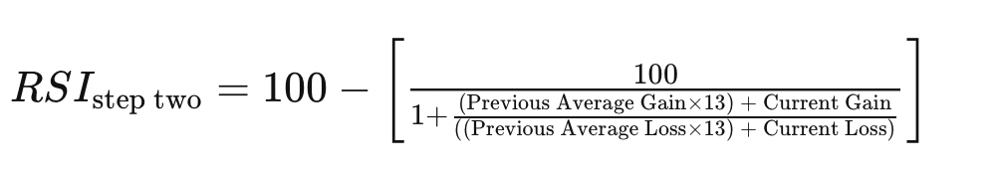

# Ateliers Trading : COURS 2 : Premières stratégies

## 1) **Introduction**

 

Il existe deux catégories de trader : les traders macro et les traders micro/quantitatifs.  
- **Macro** : l'analyse macro consiste à suivre les tendances globales (pour des actions c’est suivre le chiffre d'affaires de la boite, l'était global de l'économie, etc ...)  
**Problème** pour notre cours : il faut avoir un très gros bagage de connaissances sur comment fonctionne l’économie et il faut tout le temps être au courant de ce qui se passe.

- **Quantitatif** : en résumé, l'analyse quantitative c’est se baser uniquement sur les prix passés des marchés pour essayer de deviner le futur. On va se concentrer sur ça parceque la courbe de progression est beaucoup plus rapide et les algorithmes de trading sont en général quantitatifs. L'idée d'une stratégie quantitative c'est qu'on peut la faire tourner automatiquement sur un ordi.

 
 
 

## 2) **Bases des stratégies : les indicateurs**  

 

### **A) Comment afficher les indicateurs sur TradingView :**

- Commencez par ouvrir un marché (ici S&P500)  

- Ensuite, appuyez sur *Indicators* en haut à gauche et tapez dans la barre de recherche l'indicateur que vous voulez ajouter, puis appuyez une fois dessus pour l'ajouter au chart

- Une fois que l'indicateur est ajouté votre chart devrait ressembler à ça :

 
 

### **B) Les indicateurs basiques :**

- **Moyennes mobiles (SMA)** : indicateur qui permet de tracer la moyenne (sur une certaine longueur) des prix (on peut tracer la moyenne des open, close, high ou low mais en général on utilise le close).

    - Formule :  
      

    

> :warning: **Point important :** Pour chaque indicateur il faut rentrer des **INPUTS**, pour une moyenne mobile c'est la période sur laquelle se fait la moyenne et le prix sur lequel la moyenne est faite (close, high ...)

 
 

- **Moyennes exponentielles (EMA)** : c'est aussi une moyenne, mais plus la chandelle est proche du présent, plus elle a du "poids".  

    - Formule :   
      

    - En bleu : moyenne exponentielle de longueur 20, en noir : moyenne mobile de longueur 20. On remarque que la moyenne exponentielle "suit" plus le prix que la moyenne mobile. On dit que la moyenne exponentielle est plus réactive  

    

 
 

- **RSI (Relative Strength Index)** : le RSI est un indicateur qui permet de calculer l'accélération d'un marché et de lui donner un sens. Il est compris entre 0 et 100, quand il vaut proche de 100, on dit que le RSI indique que le marché est "overbought", si le RSI est proche de 0 alors le marché est "oversold".

    - Formule : 
    
    
    - En général, la longueur du RSI est de 14 et lorsqu'il dépasse 70 on dit que le marché est "overbought" et en dessous de 30 il est "oversold"

    

 
 
    
- **Volatility** : La volatilité (de longueur 10 par exemple) mesure la moyenne des écarts types sur les 10 dernières chandelles.
    
    - Plus la volatilité est grande, plus le marché a des gros mouvements  

    

    

 
 
 
