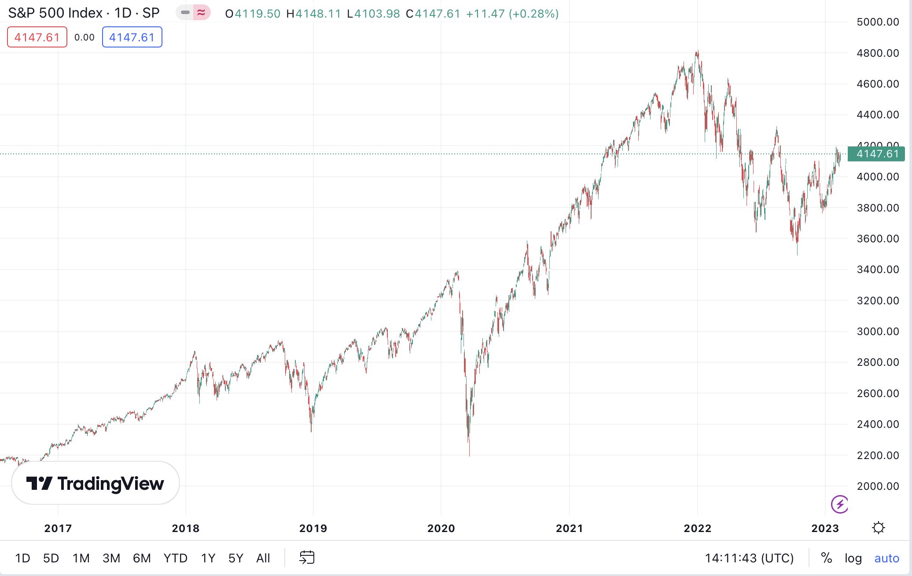
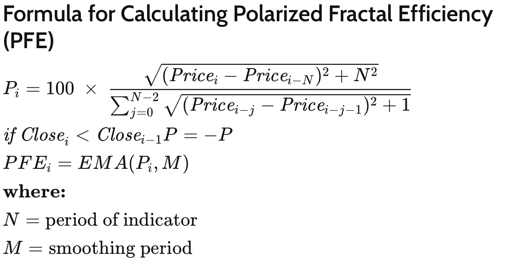
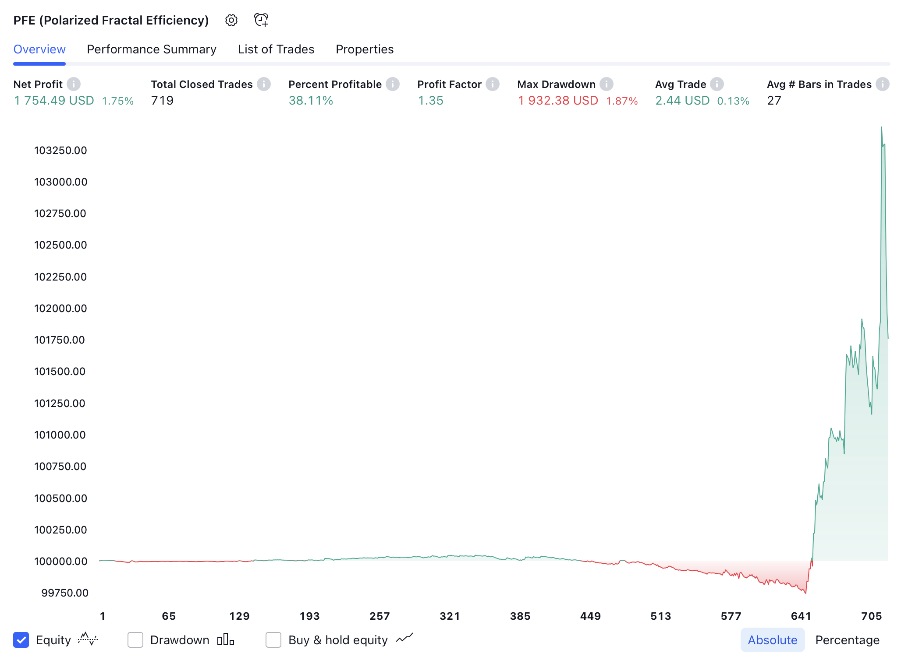

# Ateliers Trading : COURS 3 : Exemple de stratégie + risk management

## 1) **Comment trouver une stratégie en partant de 0**

 

### **Première étape : regarder le marché dans sa globalité**  
Choisir un marché assez gros : grosses actions, or, pétrole, euro-dollar ... Ensuite, dezoomer le plus possible pour essayer d'avoir une visition d'ensemble  

On essaye alors de comprendre, visuellement, quel est le type de marché : Volatile ? Tendentiel ? ...  

### **Deuxième étape : penser à un concept qui serait en accord avec le type marché**  
Par là, on veut dire que si le marché est tendentiel, alors il sera préférable de trouver une stratégie qui essaye de capter des gros mouvements. C'est le cas avec le S&P 5000 donc notre stratégie aura pour but de rentrer au début des grands mouvements  

### **Troisième étape : trouver un indicateur qui permet de "traduire" notre concept**

Partie la plus compliquée au début car on a pas trop d'expérience, mais devient plus simple par la suite.  
Dans mon cas, j'ai pensé au PFE (Polarized fractal efficiency).  

### **Quatrième étape : voir quels sont les résultats et quelles sont les amérliorations possibles**

On obtient ce résultat avec le PFE normal : 

:warning: On pourrait avoir l'impression que la stratégie est bonne car elle gagne, mais il faut toujours la comparer au marché lui même : buy and hold. La définition du buy and hold est qu'on achète au début de la période et qu'on ne clotûre jamais la position.  

On voit que les deux résultats sont quasi-pareils, donc la stratégie n'est pas efficace. Le problème c'est qu'uon peut parfois perdre beaucoup.    

**Solution** : risk management. On utilise des stoploss.
L'idée du stoploss, est que on fixe une limite de perte d'argent. Par exemple, on peut dire que si on perd plus de 100$ sur une position, on clotûre la position donc on ne pourra pas perdre plus. Ici, la ligne rouge représente le niveau du stoploss.

### **Les stoploss sont très importants car ils permettent de savoir quelle est la quantité maximale d'argent qu'on peut perdre avec nos positions**  

 

**Un autre point important** est de savoir combien d'argent on met en jeu à chaque trade ? On verra par la suite que même si on a une stratégie qui est gagnante sur le papier, si nous faisons pas attention à la quanititée misée à chaque fois, alors on sera perdants sur le long terme.

 
 
 

## 2) **Introduction au risque**

 

### **Qu'est-ce qu'il se passe lorsqu'on ne contrôle par le risque ?**

Exemple tiré du film Margin Call, basé sur la crise de 2008

 

### **Quel est le risque optimal pour une stratégie ?**  

Voir fichier Excel

 

## **Conclusion** : ##
Grâce aux stoploss, on peut contrôler la quantité d'argent misée sur chaque trade et donc, en s'appuyant sur ce qu'on a vu dans le fichier excel, on peut maximiser nos gains.